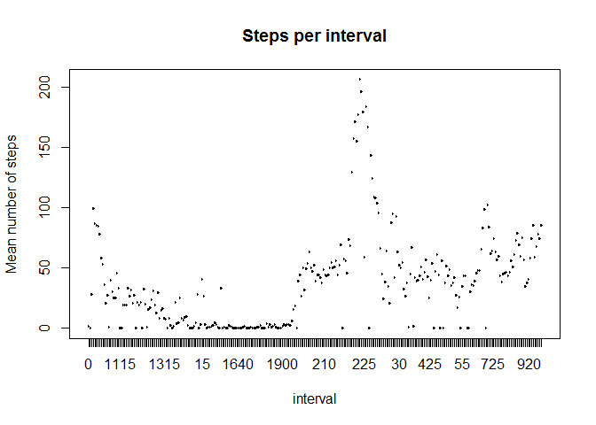
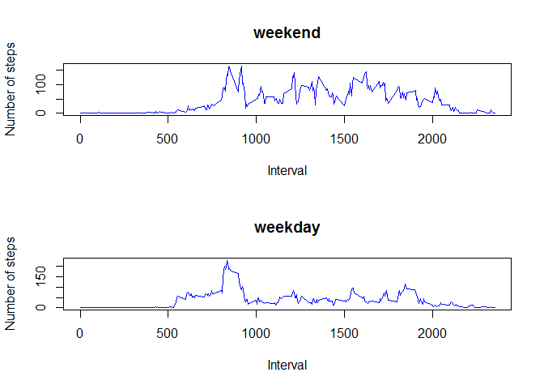

# Reproducible Research: Peer Assessment 1


## Loading and preprocessing the data
The zip file "activity.zip" should be in the working directory.

Unzip the data file and read "activity.csv" and convert interval column into a factor

Examine the first few rows of data


```r
unzip("activity.zip")
data <- read.csv(file="activity.csv", colClasses=c("numeric", "Date", "factor"))
head(data)
```

```
##   steps       date interval
## 1    NA 2012-10-01        0
## 2    NA 2012-10-01        5
## 3    NA 2012-10-01       10
## 4    NA 2012-10-01       15
## 5    NA 2012-10-01       20
## 6    NA 2012-10-01       25
```


## What is mean total number of steps taken per day?
Calculate aggregate of total steps per day and plot the results into a histogram


```r
dataDailySteps <- tapply(data$steps, data$date, sum, na.rm = T)
hist(dataDailySteps, main = "Steps per day", xlab = "Steps")
```

 

Get the mean and median steps per day

```r
meanDailySteps <- mean(dataDailySteps)
meanDailySteps
```

```
## [1] 9354.23
```

```r
medianDailySteps <- median(dataDailySteps)
medianDailySteps
```

```
## [1] 10395
```
Ignoring missing data, the  mean number of steps per daysis  **9354.2295082**. The median number of steps per day is **1.0395\times 10^{4}**.

## What is the average daily activity pattern?

Create the average daily activity pattern plot.


```r
interval <- unique(data$interval)
dataStepsPerInterval <- tapply(data$steps, data$interval, mean, na.rm=T)
plot(interval, dataStepsPerInterval, type='l', main="Steps per interval",
     xlab="interval", ylab="Mean number of steps")
```

 

Which 5-minute interval, on average across all the days in the dataset, contains the maximum number of steps?

```r
maxInterval <- names(which.max(dataStepsPerInterval))
maxInterval
```

```
## [1] "835"
```

The interval with the maximum number of steps on average: **835**

## Inputing missing values

Calculate and report the total number of missing values in the dataset (i.e. the total number of rows with NAs)

```r
indexNA <- is.na(data$steps)
countNA <- sum(indexNA)
```

The number of missing values is **2304**. 

Replace the missing values with  the mean value on the same time interval across all days.


```r
dataNoMissing <- data
dataNoMissing$steps[which(indexNA)] <- dataStepsPerInterval[match(data$interval[which(indexNA)], interval)]
```

Create a new dataset that is equal to the original dataset but with the missing data filled in.


```r
dataStepsPerDayNoNA <- tapply(dataNoMissing$steps, dataNoMissing$date, sum, na.rm=T)
```

Calculate the new mean and median for the new dataset with missing values filled in.


```r
meanStepsPerDayNoNA <- mean(dataStepsPerDayNoNA)
meanStepsPerDayNoNA
```

```
## [1] 10766.19
```

```r
medianStepsPerDayNoNA <- median(dataStepsPerDayNoNA)
medianStepsPerDayNoNA
```

```
## [1] 10766.19
```

After replacing the missing data, mean steps per day = **1.0766189\times 10^{4}**

After replacing the missing data, median steps per day = **1.0766189\times 10^{4}**.

Here is a new historgram with missing data filled in


```r
hist(dataStepsPerDayNoNA, main="Steps per day", xlab="Steps")
```

 

There is a very small change in the data, but it is not drastically changed after filling in the missing data.


## Are there differences in activity patterns between weekdays and weekends?

Create a new factor column to flag the row as weekend/weekday.


```r
dataNoMissing$day <- as.POSIXlt(dataNoMissing$date,format="%Y-%m-%d")$wday
dataNoMissing$day[dataNoMissing$day == 0] <- "weekend"
dataNoMissing$day[dataNoMissing$day == 6] <- "weekend"
dataNoMissing$day[dataNoMissing$day != "weekend"] <- "weekday"
dataNoMissing$day <- factor(dataNoMissing$day)

dataStepsPerIntervalNoNA <- with(dataNoMissing, tapply(steps, list(interval, day), mean))
```

Make a panel plot containing a time series plot (i.e. type = "l") of the 5-minute interval (x-axis) and the average number of steps taken, averaged across all weekday days or weekend days (y-axis)


```r
par(mfrow = c(2,1))
with(dataNoMissing, {
  par(mai=c(0,1,1,0))
  plot(dataStepsPerIntervalNoNA[,"weekday"], type="l", main=("Steps vs. Interval"), xaxt='n', ylab="Weekdays")
  par(mai=c(1,1,0,0))
  plot(dataStepsPerIntervalNoNA[,"weekend"], type="l",xlab="Interval",ylab="Weekend")
})
```

 

Looking at the two plots, there is more distributed steps activity during weekends compared to weekdays.
