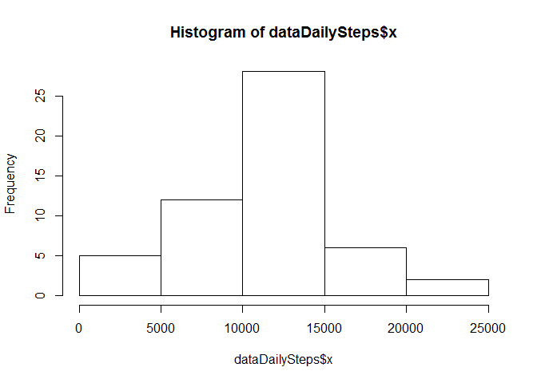
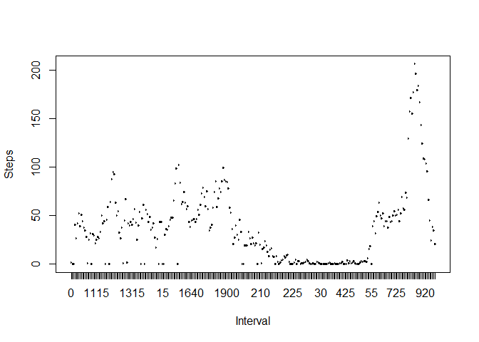
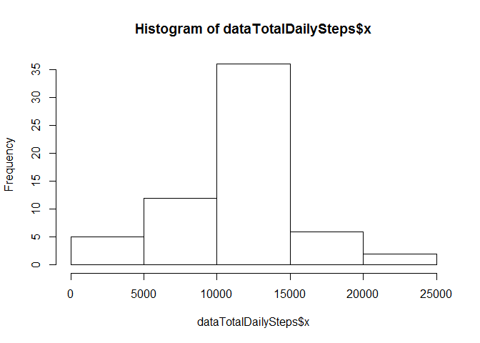
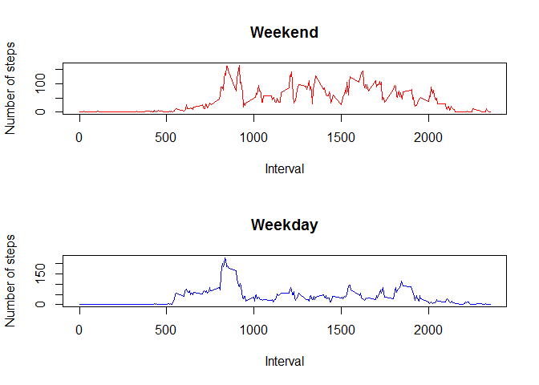

# Reproducible Research: Peer Assessment 1


## Loading and preprocessing the data
The zip file "activity.zip" should be in the working directory.

Unzip the data file and read "activity.csv" and convert interval column into a factor

Examine the first few rows of data


```r
unzip("activity.zip")
data <- read.csv("activity.csv")
head(data)
```

```
##   steps       date interval
## 1    NA 2012-10-01        0
## 2    NA 2012-10-01        5
## 3    NA 2012-10-01       10
## 4    NA 2012-10-01       15
## 5    NA 2012-10-01       20
## 6    NA 2012-10-01       25
```


## What is mean total number of steps taken per day?

Compute the total number of steps per day and plot it in a historgram


```r
dataTotalDailySteps <- aggregate(data$steps, list(data$date), sum)
hist(dataTotalDailySteps$x)
```

 

Compute the mean of total daily steps

```r
mean(dataTotalDailySteps$x, na.rm = TRUE)
```

```
## [1] 10766.19
```

Compute the median of total daily steps

```r
median(dataTotalDailySteps$x, na.rm = TRUE)
```

```
## [1] 10765
```

## What is the average daily activity pattern?

Create a plot showing the 5-minute interval (x-axis) and the average number of steps taken, averaged across all days (y-axis)


```r
dataDailyStepsMean <- aggregate(data$steps, list(data$interval), mean, na.rm = TRUE)
with(dataDailyStepsMean, plot(Group.1, x, type = "l", xlab = "Interval", ylab = "Steps"))
```

 

Determine which 5-minute interval, on average across all the days in the dataset, contains the maximum number of steps.


```r
dataDailyStepsMean[which.max(dataDailyStepsMean$x), ]$Group.1
```

```
## [1] 835
```

## Inputing missing values

Get the number of missing values in the data set

```r
sum(!complete.cases(data))
```

```
## [1] 2304
```

Use a simple method to replace the missing values by replacing the missing values with the mean number of steps for the corresponding time interval.


```r
data <- cbind(data, rep(dataDailyStepsMean$x, times = 61))
names(data)[4] <- "meanDailySteps"
incomplete <- !complete.cases(data)
data$steps <- replace(data$steps, incomplete, data$meanDailySteps[incomplete])
dataTotalDailySteps <- aggregate(data$steps, list(data$date), sum)
```

Using this new dataset, create a new histogram without missing data


```r
hist(dataTotalDailySteps$x)
```

 

Now compute the new mean.

```r
mean(dataTotalDailySteps$x)
```

```
## [1] 10766.19
```

Now compute the new median.

```r
median(dataTotalDailySteps$x)
```

```
## [1] 10766.19
```

Adding the missing data produces a small difference, but not a big difference.

## Are there differences in activity patterns between weekdays and weekends?

Create a new factor column to flag a row as weekend or weekday.


```r
dow <- weekdays(as.Date(data$date))
weekdays <- (dow == "Saturday" | dow == "Sunday")
weekdays <- factor(weekdays, c(FALSE, TRUE), c("weekday", "weekend"))
data <- cbind(data, weekdays)
dataWeekend <- data[data$weekday == "weekend", ]
dataWeekday <- data[data$weekday == "weekday", ]
```

Compute the average number of steps taken over 5 inute intervals for both weekdays and weekends.


```r
dataWeekendSteps <- aggregate(dataWeekend$steps, list(dataWeekend$interval), mean)
dataWeekdaySteps <- aggregate(dataWeekday$steps, list(dataWeekday$interval), mean)
```

Plot both weekend and weekday data


```r
par(mfrow = c(2, 1))
plot(dataWeekendSteps$Group.1, dataWeekendSteps$x, 
     type = "l", xlab = "Interval", 
    ylab = "Number of steps", col = "red", main = "Weekend")
plot(dataWeekdaySteps$Group.1, dataWeekdaySteps$x, 
     type = "l", xlab = "Interval", 
    ylab = "Number of steps", col = "blue", main = "Weekday")
```

 

Comparing the two plots, there is a bigger variation in the number of steps taken during weekends vs weekdays.
