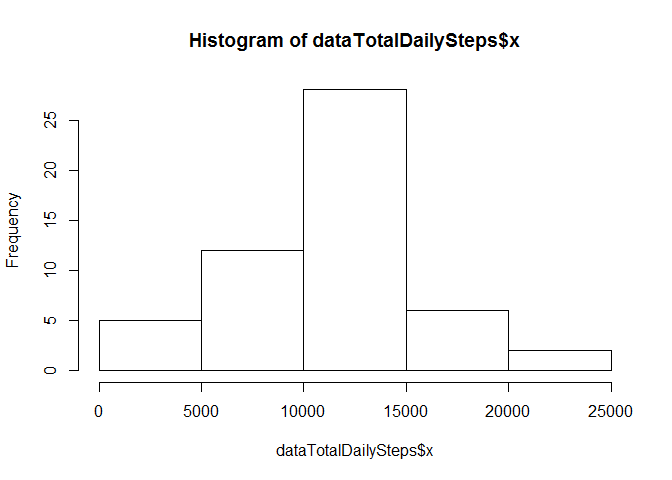

# Reproducible Research: Peer Assessment 1


## Loading and preprocessing the data
The zip file "activity.zip" should be in the working directory.

Unzip the data file and read "activity.csv" and convert interval column into a factor

Examine the first few rows of data


```r
unzip("activity.zip")
data <- read.csv(file="activity.csv", colClasses=c("numeric", "Date", "factor"))
head(data)
```

```
##   steps       date interval
## 1    NA 2012-10-01        0
## 2    NA 2012-10-01        5
## 3    NA 2012-10-01       10
## 4    NA 2012-10-01       15
## 5    NA 2012-10-01       20
## 6    NA 2012-10-01       25
```


## What is mean total number of steps taken per day?
Calculate aggregate of total steps per day and plot the results into a histogram


```r
dataDailySteps <- aggregate(data$steps, list(data$date), sum)
hist(dataDailySteps$x)
```

 

Calculate the mean of number of daily steps

```r
mean(dataDailySteps$x, na.rm = TRUE)
```

```
## [1] 10766.19
```

Calculate the median of the number of daily steps

```r
median(dataDailySteps$x, na.rm = TRUE)
```

```
## [1] 10765
```


## What is the average daily activity pattern?

Time series plot of the 5-minute interval (x-axis) and the average number of steps taken, averaged across all days

```r
dataMeanDailySteps <- aggregate(data$steps, list(data$interval), mean, na.rm=TRUE)
with(dataMeanDailySteps, plot(Group.1, x, type='l', xlab='Interval', ylab='Steps'))
```

 

Which 5-minute interval, on average across all the days in the dataset, contains the maximum number of steps?

```r
dataMeanDailySteps[which.max(dataMeanDailySteps$x),]$Group.1
```

```
## [1] 835
## 288 Levels: 0 10 100 1000 1005 1010 1015 1020 1025 1030 1035 1040 ... 955
```

## Imputing missing values


## Are there differences in activity patterns between weekdays and weekends?
